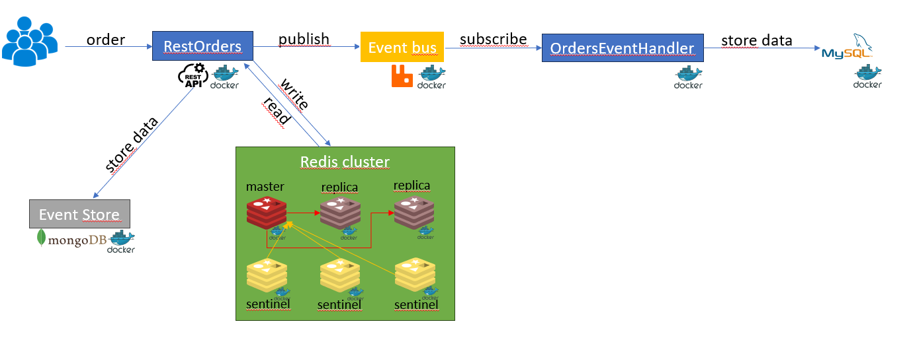

# order project
This is a sample project based on event sourcing.
Have a fun!

An API interface for ordering and retrieving orders has been exposed. The order is sent to the MongoDB database and to the Redis cluster managed by Sentinel, and then it goes into the RabbitMQ queue. This part is implemented in the RestOrders application.

The OrdersEventHandler application then receives the order data from the RabbitMQ queue and saves it to the MySQL database.

The entire project is built on docker

## order diagram

